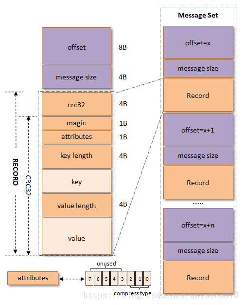
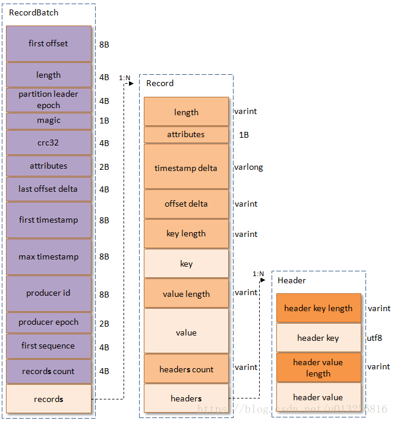

# 日志
主题有多个分区，分区有多个副本，副本对应副本日志文件，日志文件对应多个日志分段，日志分段细分为索引文件、存储文件、快照文件
## 一、文件结构
- 不考虑副本，则一个分区拥有一个Log文件夹，文件夹中包括多个LogSegment，每个LogSegment对应磁盘上的一个日志文件两个索引文件
- Log文件夹命名类似topic-name + partition，如topic-test-0、topic-test-1
- 当向Log中追加消息时，由于LogSegment是顺序性的存储，消息会追加到当前的activeSegment中，当该activeSegment满足一定条件，则创建新LogSegment，继续接受消息
- 两个索引文件分别为：offset索引文件（.index后缀）、timestamp索引文件（.timeIndex后缀）
- 每个 LogSegment 有一个baseOffset，标识当前分段第一条消息的offset
- LogSegment命名采用baseOffset，长度为20位数字，后缀为.log，如baseOffset为0，则日志、索引文件命名为
```
00000000000000000000.log
00000000000000000000.index
00000000000000000000.timeindex
```
- LogSegment还可能存在 .deleted .cleaned .swap临时文件，以及 .snapshot .txnindex等
- 创建主题时，如果log目录指定了多个，那么log文件会在分区最少的那个目录创建本次任务的文件

## 二、日志格式
早期版本——v0
 
- crc32（4B）：crc32校验值。校验范围为magic至value之间
- magic（1B）：消息格式版本号，此版本的magic值为0
- attributes（1B）：消息的属性。总共占1个字节，低3位表示压缩类型：0表示NONE、1表示GZIP、2表示SNAPPY、3表示LZ4（LZ4自Kafka 0.9.x引入），其余位保留
- key length（4B）：表示消息的key的长度。如果为-1，则表示没有设置key，即key=null
- key：可选，如果没有key则无此字段
- value length（4B）：实际消息体的长度。如果为-1，则表示消息为空
- value：消息体。可以为空，比如tomnstone消息
早期版本——v1
 
升级版本——v2
 

